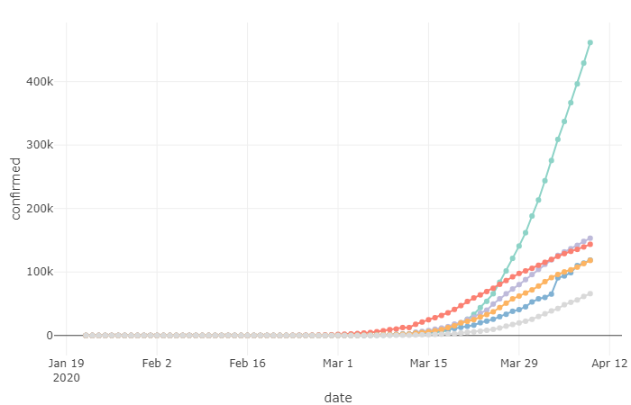
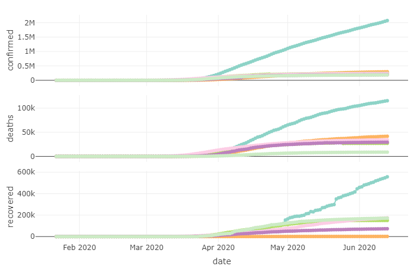
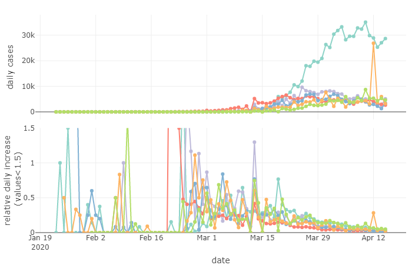
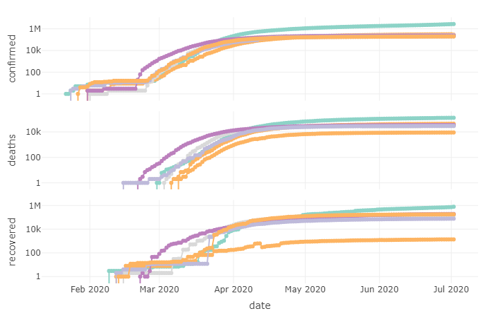

# Quick covid-19 data exploration
Quick visualizations and exploration of COVID-19 count time series based on the data provided in [github.com/CSSEGISandData/2019-nCoV](https://github.com/CSSEGISandData/2019-nCoV) hosted by the [Johns Hopkins Coronavirus Resource Center](https://coronavirus.jhu.edu/).

#### An overwiew over worldwide COVID-19 time-series in some interactive charts:

  

  
 
 Total confirmed cases 
 

  
  
 
 Total confirmed cases, deaths and recovered 
 

  
  

  

  
 
 Daily cases 
 

  
  
 
 Confirmed, deaths and recovered on log-scale
 

  
  

