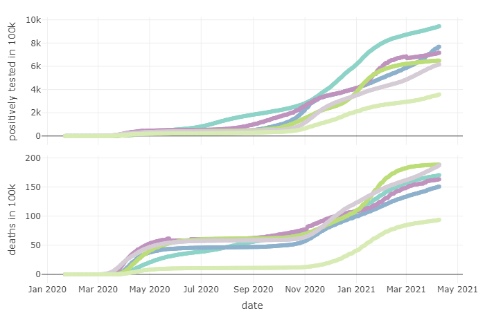
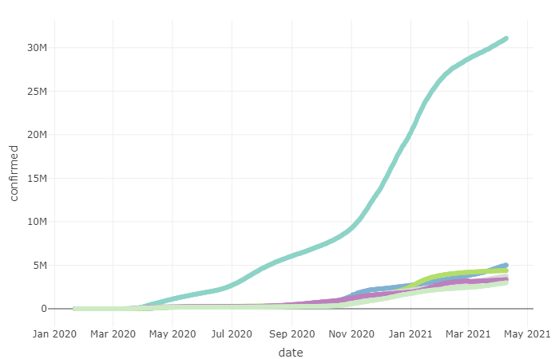
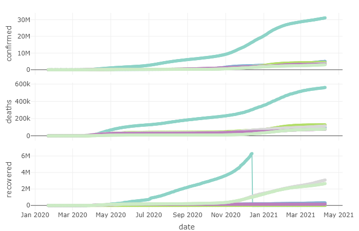
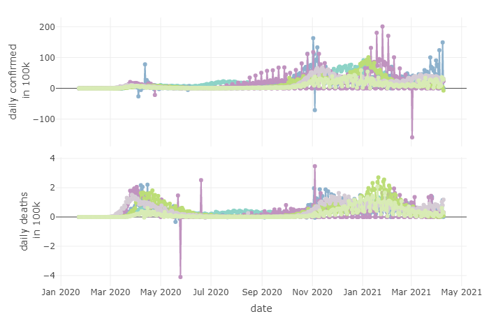
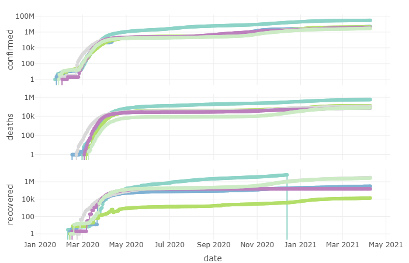

# Quick covid-19 data exploration
Quick visualizations and exploration of time series of positively tested COVID-19 
cases based on the data provided in [github.com/CSSEGISandData/2019-nCoV](https://github.com/CSSEGISandData/2019-nCoV) 
hosted by the [Johns Hopkins Coronavirus Resource Center](https://coronavirus.jhu.edu/).

For estimates of the number of positively tested cases within 100.000 population, 
population estimates of [United Nations World Population Prospects 2019](https://population.un.org/wpp/) were utilized.

#### An overwiew over worldwide COVID-19 time-series in some interactive charts:

  

   
   
 
 Registered cases in 100k population 
 

    
   
   
 
 Total registered cases 
 

    
  
  
 
 Total registered cases, deaths and recovered 
 

  
 

   
 

  
  
 
 Registered daily cases in 100k population 
 

    
     
  
 
 Registered daily cases 
 

  
  
  
 
 Confirmed, deaths and recovered on log-scale
 

  
 

